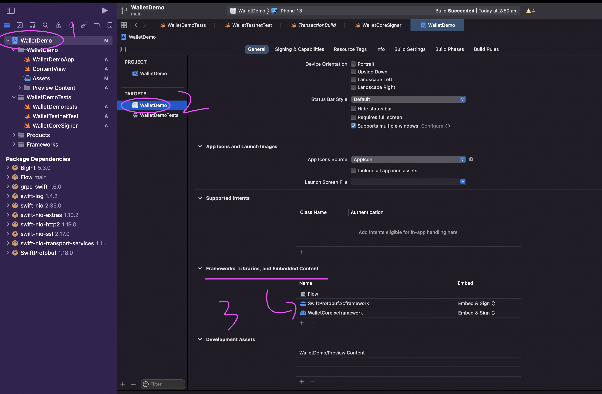

# Flow Wallet Kit

  

## ⚠️ DO NOT USE IT IN PRODUCTION ⚠️
### This SDK is still working on progress, the key generation could be wrong 🚨 

## How to use 

- Download xcframework 
> https://github.com/Outblock/wallet-core/releases/download/flow-0.1/SwiftProtobuf.xcframework.zip
> https://github.com/Outblock/wallet-core/releases/download/flow-0.1/WalletCore.xcframework.zip

- Drag it into framework section 

- Run WalletDemo from Xcode
More test case can be found [here](https://github.com/Outblock/flow-wallet-kit/blob/main/WalletDemo/WalletDemoTests/WalletDemoTests.swift)

